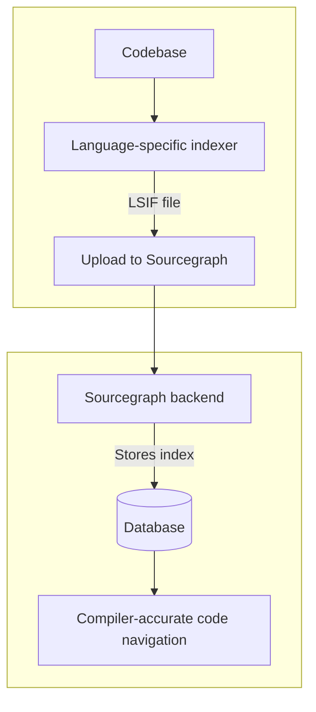
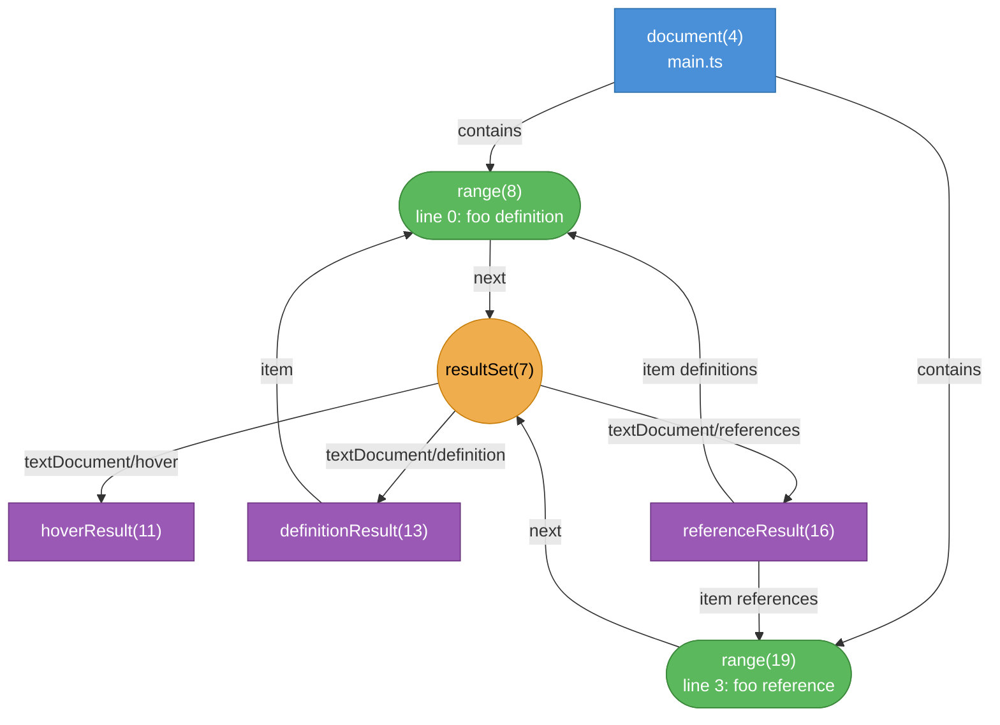
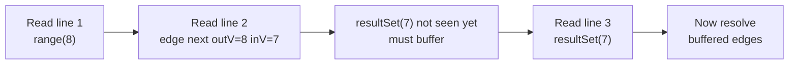

# `[blog]` `[overview]` SCIP - A Better Code Indexing Format than LSIF

Source: sourcegraph's blog

Link: https://sourcegraph.com/blog/announcing-scip

Keywords:

- Indexing format

Takeaways:

> An indexing format should be aware of:
>
> - Human-readability for debuggability.
> - Allow for local reasoning.
> - Allow for incrementalization.

## Introduction

> "Sourcegraph Inc. is a company developing code search and code intelligence tools that semantically index and analyze large codebases so that they can be searched across commercial, open-source, local, and cloud-based repositories."

An indexing format is a quickly queryable representation of an entity. Previously, we have LSIF (Language Server Index Format), an open-source standard by Microsoft that serves as a standard indexing format for codebases, enabling rich code navigation, highlighting, etc. This article identified some pain points of LSIF, and thus, the motivation for SCIP.

As indexing formats enable a large part of the Sourcegraph ecosystem, this is a crucial component, especially for code navigation.

## Background

There are two fundamentally different ways to implement code navigation: text/heuristic-based and semantic.

Text-based approaches (ctags, tree-sitter) are faster and language-agnostic, but they make mistakes. "Go to definition" might take you to a function with the same name in a different module. "Find references" might miss usages behind aliases or dynamic dispatch. Good enough for quick exploration, bad for anything that requires correctness.

It's worth separating ctags and tree-sitter here, because they're quite different in what they actually do.

- ctags is purely text/regex-based. It scans source files and extracts symbol names and their locations using patterns, with no real parsing. No understanding of scope, types, or imports. "Go to definition" just finds the nearest thing with that name. Inherently search-based.

- Tree-sitter is a proper incremental parser. It builds a full, language-aware AST, so it actually understands syntax. In principle it could do more than ctags. But it stops at the **syntax level**: it doesn't resolve names. It can tell you "this token is an identifier," but not "this identifier refers to _that_ declaration over in _that_ file." That resolution step (name binding, type inference, import resolution) requires a type-checker or a full compiler front-end, which tree-sitter doesn't do and isn't meant to do.

So the bottleneck isn't parsing, it's _name resolution_. To know where a symbol actually comes from, you need the full semantic graph of the program, not just its syntax tree. That's what language servers (via LSP) and indexers (via LSIF/SCIP) provide, sitting on top of a compiler.

Semantic approaches actually run a language-aware indexer, essentially a compiler front-end, that resolves symbols with full type information. The results are compiler-accurate: no false positives, no missed references, cross-repository aware. The catch is that this is expensive to set up. You need a working build environment, a language-specific indexer, and a pipeline to feed the output into wherever you're querying from.

Sourcegraph built their precise navigation on LSIF. The flow is: a language-specific indexer runs against your codebase and dumps an LSIF file, you push that file to Sourcegraph, Sourcegraph ingests and indexes it, and from that point on you get compiler-accurate navigation across repos.

<div style="text-align: center">



</div>

> This is actually a new workflow for me...

## Detour: LSIF Format

LSIF is newline-delimited JSON (one object per line). Every line is either a **vertex** or an **edge**, distinguished by a `"type"` field. Every object also has an `"id"` (a monotonically-increasing integer) and a `"label"` (the semantic kind).

```json
{ "id": 7,  "type": "vertex", "label": "resultSet" }
{ "id": 10, "type": "edge",   "label": "next", "outV": 8, "inV": 7 }
```

Vertices represent things: documents, ranges (spans of code), result hubs, hover content, definition locations, reference sets. Edges connect them using `outV` (from) and `inV` / `inVs` (to). The IDs carry no meaning on their own; they're just handles for wiring the graph together.

Key vertex types:

| Label              | What it represents                                    |
| ------------------ | ----------------------------------------------------- |
| `document`         | A source file                                         |
| `range`            | A span within a file (`start`/`end` line + character) |
| `resultSet`        | A hub shared by all ranges of the same symbol         |
| `hoverResult`      | The hover popup content                               |
| `definitionResult` | Where a symbol is defined                             |
| `referenceResult`  | All definition and reference locations                |

Key edge types:

| Label                     | Meaning                                       |
| ------------------------- | --------------------------------------------- |
| `contains`                | Document owns ranges. Project owns documents  |
| `next`                    | Range delegates to its resultSet              |
| `textDocument/hover`      | resultSet points to hover content             |
| `textDocument/definition` | resultSet points to definition locations      |
| `textDocument/references` | resultSet points to reference set             |
| `item`                    | Binds a result vertex back to concrete ranges |

The `resultSet` is the central design idea. Consider a symbol like `foo` that appears 50 times across a codebase — once as a definition and 49 as references. Naively, you'd attach hover content, definition location, and reference list to each of those 50 ranges individually. That's a lot of duplication.

Instead, LSIF introduces a `resultSet` as a shared hub: all 50 ranges point to the same `resultSet` via a `next` edge, and the actual results (hover, definition, references) hang off the `resultSet` once. When you query "what's the hover for range(19)?", you follow `next` to get the `resultSet`, then follow `textDocument/hover` to get the result.

It's a reasonable design for compactness, but it adds an indirection step to every query. And because everything is wired by opaque IDs, you have to load the entire graph into memory to efficiently resolve anything — you can't jump to a range and read its data directly, you have to chase IDs across the whole file.

## Challenges of LSIF

Sourcegraph has built dozens of LSIF indexers, from prototype to production grade, covering Go, Java, Scala, Kotlin, TypeScript, and JavaScript.

At scale, that means 45k+ repos with precise navigation enabled and 4k+ LSIF uploads processed per day. At that point, the cracks in the protocol become hard to ignore.

Most of the pain traces back to one design decision: LSIF uses a graph encoding with opaque numeric IDs to connect vertices and edges. Here's what that looks like for this TypeScript snippet:

```typescript
// main.ts
function foo(): void {} // line 0: foo is defined here

const x = 1;
foo(); // line 3: foo is referenced here
```

The LSIF graph for this looks like (notation: `vertexLabel(id)` where the number is the opaque integer ID assigned by the indexer):

<div style="text-align: center">



</div>

Every connection is expressed as `{id, type: "edge", outV: N, inV: M}` where N and M are opaque integers. That single choice cascades into a bunch of problems:

1. **No machine-readable schema, no static types**:
   - LSIF has no formal schema. Every line is a free-form JSON object, so when writing an indexer or reader you're working with raw maps and doing manual field access.

2. **Large in-memory data structures**: Because edges reference IDs that may not have appeared yet in the file, you can't process LSIF as a stream. You have to buffer everything first, then resolve references. For a large repo with millions of ranges and edges, this means holding the full graph in memory before you can answer a single query.



3. **Opaque IDs make debugging painful**: When something goes wrong, you're staring at a wall of numbers with no context. There's no way to tell what ID 7 or ID 13 represents without mentally tracing the whole graph from the start.
   ```json
   {"id":14,"type":"edge","label":"textDocument/definition","outV":7,"inV":13}
   {"id":15,"type":"edge","label":"item","outV":13,"inVs":[8],"document":4}
   ```

What is `outV:7`? What is `inV:13`? What range is `8`? You have to scroll back through the file and match IDs by hand.

4. **Incremental indexing is hard**: IDs are globally monotonically increasing. If you index file A and get IDs 1 to 500, then index file B and get IDs 501 to 1000, you can't independently re-index just file A later since the new IDs would collide or require renumbering. Merging two separately-generated LSIF outputs is also non-trivial because both start their IDs from 1.

   ```
   Index run 1 (full):   range(8) -> resultSet(7) -> definitionResult(13)
   Index run 2 (file A): range(1) -> resultSet(2) -> definitionResult(3)  // ID collision
   ```

> The vibe I get is that the problem of LSIF is that it's too monolithic & isn't modular. Local analysis of LSIF file is not really possible - a global picture is required.

SCIP addresses all of this by replacing the graph encoding with a Protobuf schema built around human-readable string IDs for symbols, dropping the concepts of "monikers" and "resultSet" entirely.

## SCIP

The SCIP schema is a Protobuf schema. The design is heavily inspired by SemanticDB, a code indexing format that originated in the Scala ecosystem.

Sourcegraph reported a wide range of improvements:

1. **Development speed**: Static types from the Protobuf schema give rich editor completions and catch typos at compile time. Human-readable string symbols make debugging much more straightforward. Abstractions like import/export monikers that could silently break navigation in LSIF are gone.
2. **Runtime performance**: They saw a 10x speedup in CI when replacing `lsif-node` with `scip-typescript` (though not entirely attributable to the protocol itself).
3. **Index size**: LSIF indexes are on average 4x larger gzip-compressed and around 5x larger uncompressed compared to equivalent SCIP payloads.
4. **Testability**: Sourcegraph built a snapshot testing utility on top of SCIP that is reused across indexers. Snapshot testing with LSIF was painful by comparison.

Don Stewart from Meta integrated SCIP with Glean (Meta's system for collecting and querying facts about code) and found SCIP to be 8x smaller and processable 3x faster than LSIF. The mapping into Glean was around 550 lines of code vs. 1500 for LSIF.

SCIP also unblocks use cases that LSIF struggled with:

1. **Incremental indexing**: Because symbols are identified by human-readable strings rather than global IDs, re-indexing only the changed files becomes feasible. Users would wait less for precise navigation to become available after a push.

2. **Cross-language navigation**: Navigating between, say, a Protobuf definition and its generated Java or Go bindings becomes possible. This kind of cross-language linking was essentially out of reach with LSIF.

## Detour: SCIP Format

Sources:

- https://github.com/sourcegraph/scip/blob/main/scip.proto
- https://github.com/sourcegraph/scip/blob/main/docs/DESIGN.md
- https://github.com/sourcegraph/scip-typescript/tree/main/snapshots/output

For the same `foo` example, here's what SCIP looks like (shown as JSON, actually Protobuf binary):

````json
{
  "metadata": {
    "toolInfo": { "name": "scip-typescript" },
    "projectRoot": "file:///project"
  },
  "documents": [
    {
      "language": "typescript",
      "relativePath": "src/main.ts",
      "occurrences": [
        {
          "range": [0, 9, 12],
          "symbol": "scip-typescript npm . . src/`main.ts`/foo().",
          "symbolRoles": 1
        },
        {
          "range": [3, 2, 5],
          "symbol": "scip-typescript npm . . src/`main.ts`/foo().",
          "symbolRoles": 0
        }
      ],
      "symbols": [
        {
          "symbol": "scip-typescript npm . . src/`main.ts`/foo().",
          "documentation": ["```ts\nfunction foo(): void\n```"],
          "kind": "Function"
        }
      ]
    }
  ]
}
````

Two occurrences, one symbol entry. No graph, no edges, no resultSet. The same LSIF equivalent required a document vertex, two range vertices, a resultSet, a hoverResult, a definitionResult, a referenceResult, and six edges.

> Takeaway: So just a locally-processed form of a file.

Cross-file and cross-repo references work the same way: any occurrence in any document carrying the same symbol string is linked, purely by string equality. The consumer builds a hashtable at index load time.

### Cross-file symbol resolution

There are no cross-file edges or pointers. It's just a hashtable.

When the consumer loads all documents, it builds a map:

```
symbol string -> list of (document, range, roles)
```

Every occurrence in every document gets inserted into this map by its symbol string. "Go to definition" is a lookup: find all entries for this symbol string where `roles & Definition != 0`. "Find references" is the same lookup without the role filter.

So for `foo` defined in `a.ts` and referenced in `b.ts`:

```
# a.ts indexer emits:
{ range: [0, 9, 12], symbol: "...`a.ts`/foo().", symbolRoles: 1 }  // Definition

# b.ts indexer emits:
{ range: [5, 0, 3],  symbol: "...`a.ts`/foo().", symbolRoles: 0 }  // Reference
```

Both carry the same symbol string. The consumer puts both into the map. When you hover `foo` in `b.ts`, it looks up `"...`a.ts`/foo()."`, finds the definition entry in `a.ts`, and navigates there.

Cross-repo works identically. The `<package>` component (`npm @example/a 1.0.0`) makes the string globally unique across repos. Two indexes from different repos get loaded into the same map, and the lookup is no different.

## Personal Takeaways

An indexing format should be aware of:

- Human-readability for debuggability.
- Allow for local reasoning.
- Allow for incrementalization.
