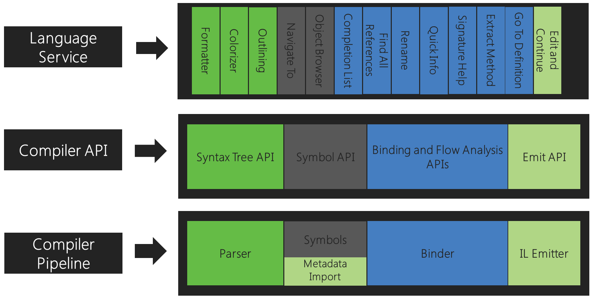
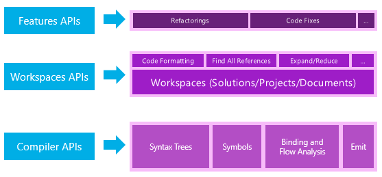
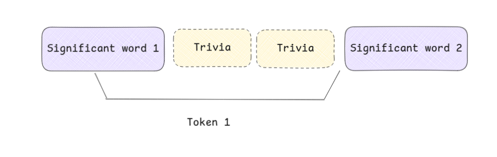
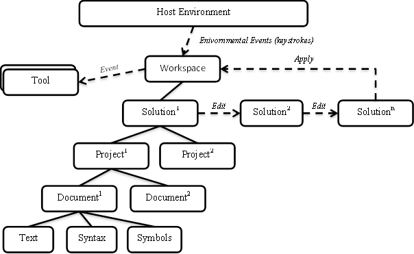

# `[tool]` `[seminal]` .NET Compiler Platform ("Roslyn") Overview

Source: dotnet/roslyn (GitHub)

Link: https://github.com/dotnet/roslyn/blob/main/docs/wiki/Roslyn-Overview.md

Keywords:

- Syntax tree
- Semantic model

Takeaway:

> - Roslyn represents a revolutionary step: Exposing the internal compilation pipeline as a public API.
> - Two main API layers:
> - Lower-level compiler APIs for detailed code analysis.
> - Higher-level workspace APIs for managing complete solutions within a host environment.
> - Core data models representing the code are completely immutable and preserve full fidelity to enable thread-safe analysis without data duplication.
>   - ASTs are composed of 3 items: nodes (non-terminals), tokens (terminals), and trivia.
>   - Trivia are attached to adjacent tokens instead of being in the ASTs.
>   - Each AST item exposes a span.
>   - Tokens and Trivia are expressed as value types.
> - The state flow relies on an active, mutable workspace containing strictly immutable solution snapshots.

## Abstract

This document details the motivation behind the Roslyn's team's decision to expose the compiler APIs and its object model, highlighting the trend of "compiler as a platform".

The important part is their object model and compiler APIs. Object model is basically the data that the compiler API accepts or returns.

## Introduction

Compilers are traditionally black boxes:

- Source code goes in.
- Object code comes out.
- The internal model is discarded. This internal model contain deep understanding of the original code.

However, that model, built through parsing, name resolution, and type checking, is exactly what IDE features need. IntelliSense, Go to Definition, Find All References, intelligent rename - all of these require compiler-level understanding of the code.

Roslyn is the .NET Compiler Platform for C# and Visual Basic. Its mission is to open up that black box: instead of every tool rebuilding a partial, inaccurate approximation of what the compiler already computed, Roslyn exposes the compiler's own data structures as a stable public API.

The same object models that power Visual Studio's own language features are available to any external tool. The VS IDE was rebuilt on top of the public Roslyn APIs as a validation of this claim - if the public API isn't sufficient for world-class IDE features, it isn't good enough.

> This advocates for the view of "compilers as platforms". To be more precise, compilers provide necessary information that powers all code IntelliSense.

## Exposing the Compiler APIs

### Compiler Pipeline

Roslyn exposes to the consumer each phase of the traditional compiler pipeline as a separate, queryable component:

| Phase (API) | What it does                                                   | Exposed as (Object model) |
| ----------- | -------------------------------------------------------------- | ------------------------- |
| Parse       | Tokenize and parse source text                                 | Syntax tree               |
| Declaration | Analyze declarations + imported metadata to form named symbols | Hierarchical symbol table |
| Bind        | Match identifiers to symbols                                   | Semantic model            |
| Emit        | Produce IL bytecode                                            | Emit API                  |

Every phase is independently accessible. You can parse a file with no compilation context, or query the semantic model of a specific expression without touching the emit phase.

A visualization from [Roslyn](https://github.com/dotnet/roslyn/raw/main/docs/wiki/images/compiler-pipeline-api.png):

Because each phase has a well-defined object model, each compiler combines these phases together to form an end-to-end whole.

As in the picture above, some language services map to some phases and object models.

### API Layers

Two main layers of APIs: Compiler APIs and Workspaces APIs.

#### Compiler APIs

The lowest layer. Exposes the object models corresponding to each pipeline phase, both syntactic and semantic. No dependency on Visual Studio.

Contains:

- Object models for each pipeline phase:
  - Syntax trees.
  - Symbol tables.
  - Semantic models.
- An immutable snapshot of a single invocation of a compiler:
  - Assembly references.
  - Compiler options.
  - Source code files.

C# and VB have separate but shape-compatible APIs in this layer. This layer has no dependencies on Visual Studio components.

#### Diagnostic APIs

Extensible diagnostics (can be user-defined) cover:

- Syntax errors.
- Semantic errors.
- Definite assignment errors.
- Warnings.
- Informational.

#### Hosting/Scripting APIs

Used for:

- Code snippet execution.
- Accumulate a runtime execution context.

The REPL utilizes these.

#### Workspaces APIs

The higher-level layer:

- Organizes an entire solution (projects, files, references, options) into a single object model.
- Handles project-to-project dependency resolution automatically.
- Gives direct access to compiler layer objects without manual setup.
- Surfaces higher-level IDE APIs:
  - Find All References.
  - Formatting.
  - Code Generation.

No dependency on Visual Studio.

## Parse API / The Syntax Tree Object Model

Purposes:

- Allow tools to process the syntactic structure of a project.
- Enable tools to manipulate source codes.

> This seems to document the public interface, not how internally, how it is all organized.

Overview:

- 3 main syntactic categories: nodes (non-terminal), tokens (terminal), trivia (attached to tokens).
- Each node/token/trivia has a `Span` and a `FullSpan`, containing the first position + the character count.
  > Span may be computed on the fly, else, AST edits would invalidate a large number of spans in the AST. Also, if implemented this way, `SyntaxToken` cannot be reused. Therefore, probably a red-green tree design might me used underneath.
- Nodes have both properties for `Parent` and children.
  > Red-green trees must be involved here for the tree nodes to be immutable.

### Syntax Trees

Essentially a tree data structure:

- Internal nodes are parents of other nodes.
- Made up of nodes, tokens and trivia.

Three key properties:

- Full fidelity/Lossless: every token, whitespace, comment, preprocessor directive, and syntax error is preserved. Nothing is thrown away.
- Round-trippability: any subtree can reconstruct its exact source text. Editing the tree is equivalent to editing the source.
- Immutability & Thread-safe:
  - Trees are snapshots that do not change.
  - Allow structural sharing & node-reusing.
  - Allow thread-safe accesses without locks.

### Syntax Nodes

- Represent non-terminal elements: declarations, statements, clauses, expressions.
- Always non-terminal nodes in the syntax tree - Only tokens can be terminal nodes.

The class hierarchy:

- A base class: `SyntaxNode`.
- Each category of syntax node is a subclass of a `SyntaxNode`.
- New, custom node classes can not be added.

The classes:

- `Parent` property: A node's parent. The root node has a null parent.
- `ChildNodes` method: A sorted list of child nodes (do not include tokens).
- A collection of `Descendant*` methods:
  - `DescendantNodes`: The list of all nodes in the sub-tree rooted at a node. (In what order though?)
  - `DescendantTokens`: The list of all tokens in the sub-tree rooted at a node. (Is it sorted?).
  - `DescendantTrivia`: The list of all trivia in the sub-tree rooted at a node.
- Type-safe children properties.
  - Example: `BinaryExpressionSyntax` has `Left`, `OperatorToken` and `Right` additionally.
  - Some can be optional.

### Syntax Tokens

- Terminals: keywords, identifiers, literals, punctuation.
- Never are parents.

Implementation:

- Implemented as CLR value types (one struct for all token kinds) for performance. Typed as `Object`.
- Carry both raw source text and a decoded value (`Value` for the typed result, `ValueText` for the Unicode-normalized string).

### Syntax Trivia

- Insignificant to the understanding of the code: whitespace, comments, preprocessor directives.
- Still kept for full fidelity and round-trippability.

Relationship with tokens:

- Not tree children in the normal sense - attached to adjacent tokens via `LeadingTrivia` / `TrailingTrivia`. A token owns any trivia after it on the same line up to the next token.
- Do not have parent.
- First trivia of the line belong to the first token.

Implementation:

- `Token` property: The owning token.
- Also CLR value types: `SyntaxTrivia`

### Spans

The position & length information of a node, token or trivia.

- Text position = A 32-bit integer that is a zero-based Unicode character index.
- Text span = A beginning position + A count of characters. If the count is zero, it refers to the position after the beginning position but before the next character.

A node has 2 `TextSpan`:

- `Span`: text range of the node excluding trivia.
- `FullSpan`: text range including leading/trailing trivia.

Both are zero-based Unicode character indices.

### Kinds

- Every node, token or trivia has a `RawKind` castable to a language-specific `SyntaxKind` enum.
  - This disambiguates elements sharing the same class - e.g., `BinaryExpressionSyntax` can be `AddExpression`, `SubtractExpression`, etc.
    > So `RawKind` doesn't have an inherent meaning?
- For tokens and trivia, `RawKind` is the only way to distinguish element types.

> So basically, `SyntaxNode` is the low-level underlying representations for the "higher-level" node types appearing in some specific programming language?

### Error Recovery

Malformed code still produces a full, round-trippable tree. Two strategies:

- **Missing token**: Expected but absent token is inserted as a zero-width node (`IsMissing = true`).
- **Skipped tokens**: The parser may skip tokens during error recovery. Unrecognized tokens are attached as `SkippedTokens` trivia.
  > So Lexing and Parsing must be happening at the same time, as otherwise, `SyntaxToken` wouldn't be immutable.

## Declaration/Binding API + Hierarchical symbol table/Semantic model

- Name resolution.
- References to compiled libraries.

### Compilation

- Represents everything needed to compile a program: source files, assembly references, compiler options.
- Contains methods for finding and relating the symbols declared in source code or metadata from compiled libraries.
- Immutable - changes produce a new `Compilation` derived from the old one.

Entry point for all semantic queries: symbol lookup by name, access to the global namespace tree, getting a `SemanticModel` for any source file.

### Symbols

Overview:

- Represents a declared elements in the source code or compiled libraries' metadata.
- Namespaces, types, methods, properties, fields, events, parameters are all represented by symbols.
- A `Compilation` has methods and properties to retrieve symbols or the symbol table as a tree of symbols.

Class hierarchy:

- `ISymbol`: The interface that all symbls implement.

Symbol implementation:

- Additional information that symbol's methods and properties can retrieve:
  - Other referenced symbols.

Effects:

- A consistent representation for namespaces, types, and members across both source code and metadata.
- Elements from source code and imported metadata are treated exactly the same (e.g., a method from source code & metadata are represented by an `IMethodSymbol` with identical properties).

Symbols are somewhat similar to the CLR type system (`System.reflection` API), but they can model more than types and are a representation of language concepts.

For instance, an iterator method:

- A single language symbol.
- A CLR type and CLR multiple methods.

### Semantic Model

Scoped to a single source file. Answers:

- What symbol does this identifier resolve to?
- What is the type of this expression?
- What diagnostics apply here?
- How do variables flow in/out of this region?

Obtained from `Compilation` by passing a `SyntaxTree`. Queries are lazy and cached.

## Workspace API

- Entrypoint for whole-solution analysis and refactoring.
- Organization of information about projects in a solution into 1 object model: Direct access to compiler layer object models.
- Host environments, e.g. IDEs, a workspace ~ an open solution.
- Loading a solution also utilizes this model.

### Workspace

- Workspace: An active representation of a solution.
  - Solution: A collection of projects.
  - Project: A collection of documents.
- Workspace -> A host environment, which is constantly changing.
  - Can be created and run independently without needing a host environment or UI.
- Update mechanism:
  - Fires events when the host environment changes (e.g. user typing).
  - Automatically updates the `CurrentSolution` property.
  - The fired event indicates that the workspace and which particular document has changed. -> Consumers can listen to these.

### Solutions, Projects, Documents

Overview

- Workspaces change continuously with user input, but they provide access to isolated, immutable solution models.
- Solutions are thread-safe snapshots of projects and documents that can be shared without locking or duplication.

Component hierarchy

- Projects are immutable solution components that bundle source documents, references, and options to grant direct access to compilations.
- Documents are immutable project components representing individual source files that provide access to raw text, syntax trees, and semantic models.

Modifications

- A solution instance obtained from the workspace will never change.
- You apply updates by constructing a new solution instance based on your specific changes and explicitly applying it back to the workspace.

Visualization of the relationship from Roslyn:

