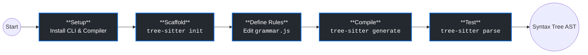
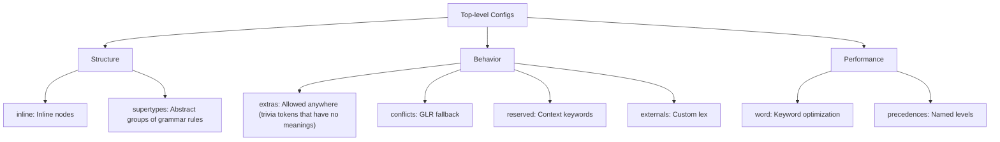

# Tree-sitter Grammar Syntax

Source: tree-sitter

Link: https://tree-sitter.github.io

## Dependencies

- **JavaScript runtime**: Node.js (to execute `grammar.js`)
- **C Compiler**: GCC, Clang, or MSVC (to compile the generated C code)
- **Tree-sitter CLI**: Installed via npm, Cargo, or downloaded binary. For Nix, use `tree-sitter`

## Basic Flow



1. **Initialize** with `tree-sitter init`: Creates a project template with `grammar.js`, `src/`, and test files.
2. **Define grammar** in `grammar.js`:

   ```js
   module.exports = grammar({
     name: "my_language",
     rules: {
       source_file: ($) => repeat($.statement),
       statement: ($) => seq($.identifier, ";"),
       identifier: ($) => /[a-z]+/,
     },
   });
   ```

3. **Generate** with `tree-sitter generate`: Compiles `grammar.js` to C code in `src/parser.c`.
4. **Test** with `tree-sitter parse <file>`: Parse a sample file and inspect the resulting syntax tree.
5. **Iterate**: Refine rules, regenerate, test until the grammar is correct.

## Grammar DSL

The Grammar DSL is a set of JavaScript functions for expressing syntax rules. All patterns are built from simple, composable blocks.

### Quick Reference

| Pattern        | Example                           | Matches                               |
| -------------- | --------------------------------- | ------------------------------------- |
| Literal string | `"if"`                            | Exactly the text "if"                 |
| Regex          | `/\d+/`                           | One or more digits                    |
| Sequence       | `seq(a, b, c)`                    | a followed by b followed by c         |
| Choice         | `choice(a, b)`                    | Either a or b                         |
| Repeat         | `repeat(a)`                       | Zero or more of a                     |
| Repeat 1+      | `repeat1(a)`                      | One or more of a                      |
| Optional       | `optional(a)`                     | Zero or one of a                      |
| Symbol ref     | `$.rule_name`                     | Reference another rule                |
| Token          | `token(a)`                        | Squash a into single leaf node        |
| Precedence     | `prec(1, a)`                      | Resolve conflicts, higher number wins |
| Associativity  | `prec.left(a)` or `prec.right(a)` | Group left-to-right or right-to-left  |

### Pattern Functions

Core DSL functions for building rules in `grammar.js`. All rules are functions accepting `$`, which provides access to other rules.

#### Basic Patterns

- **Symbols (the `$` object)**: Reference other grammar rules.

  ```js
  rules: {
    expression: $ => $.identifier,  // Reference the 'identifier' rule
    identifier: $ => /[a-z]+/
  }
  ```

  Pitfall: avoid rule names starting with `MISSING` or `UNEXPECTED`, as `tree-sitter test` treats them specially.

- **String literals**: Match exact text (become anonymous nodes in the AST).

  ```js
  rules: {
    keyword: $ => 'if',     // Matches exactly "if"
    semicolon: $ => ';',    // Matches exactly ";"
  }
  ```

- **Regular expressions**: Match patterns (become anonymous nodes in the AST).

  ```js
  rules: {
    number: $ => /\d+/,                           // Digits
    identifier: $ => new RustRegex('(?i)[a-z]+') // Case-insensitive
  }
  ```

  Tree-sitter compiles JS regex to C using Rust's regex syntax, ignoring JS semantics. Lookaheads (`?=`) and lookbehinds (`?<=`) are not supported (break LR(1) parsing).

- **Sequences**: Match rules in strict order.

  ```js
  rules: {
    return_statement: ($) => seq("return", $.expression, ";");
  }
  ```

- **Choices**: Match any one rule (logical OR).

  ```js
  rules: {
    literal: ($) => choice("true", "false", $.number);
  }
  ```

  Order does not matter. If choices overlap, use `prec()` to resolve conflicts.

#### Repetition and Optionality

- **Repetitions**: Match a rule zero or more times (`repeat`) or one or more times (`repeat1`).

  ```js
  rules: {
    block: $ => seq('{', repeat($.statement), '}'),     // 0+
    list: $ => repeat1($.identifier),                     // 1+
  }
  ```

  Tip: use `repeat(X)` instead of `optional(repeat1(X))`.

- **Options**: Match a rule zero or one time.

  ```js
  rules: {
    class_declaration: ($) => seq(optional("export"), "class", $.identifier);
  }
  ```

#### Advanced Patterns

- **Tokens**: Squash a complex sequence of strings and regexes into a single leaf node.

  ```js
  rules: {
    html_comment: ($) => token(seq("<!--", /.*/, "-->"));
  }
  ```

  `token()` only accepts terminal rules (strings, regexes, `seq`, `choice`). Cannot pass non-terminal symbols (like `$.statement`).

- **Immediate tokens**: Force a token to match only when physically touching the previous token (no intervening whitespace).

  ```js
  rules: {
    decorator: ($) => seq("@", token.immediate(/[a-zA-Z_]\w*/));
  }
  ```

- **Field names**: Give child nodes semantic names for easier access.

  ```js
  rules: {
    assignment: ($) =>
      seq(field("target", $.identifier), "=", field("value", $.expression));
  }
  ```

- **Aliases**: Rename a rule's node type in the AST.

  ```js
  rules: {
    expression: ($) => alias($.identifier, $.variable); // Appears as 'variable' node
  }
  ```

### Conflict Resolution

When multiple grammar rules could match the same input, use precedence and associativity to disambiguate.

- **Precedence (`prec(number, rule)`)**: Assign numerical priority to resolve conflicts. Higher number wins.

  ```js
  rules: {
    unary_expression: $ => prec(1, seq('-', $.expression)),
    binary_expression: $ => seq($.expression, '-', $.expression)
  }
  ```

  There are two flavors of precedence depending on context:
  - **Parse precedence** (structural): Resolves LR(1) conflicts at compile time. Higher number wins.
  - **Lexical precedence** (tokens): Resolves which token definition matches at the character level. Wrap in `token()`.

  Default precedence is `0`. Use negative numbers to deprioritize. To apply lexical precedence, nest inside `token()`: `token(prec(1, 'keyword'))`.

- **Associativity**: When precedence values are equal, associativity acts as a tie-breaker.

  ```js
  rules: {
    subtraction: ($) => prec.left(1, seq($.expr, "-", $.expr)); // (1 - 2) - 3
  }
  ```

  ```js
  rules: {
    assignment: ($) => prec.right(1, seq($.id, "=", $.expr)); // a = (b = c)
  }
  ```

  Only matters when precedence is tied. If rule A has precedence 2 and rule B has precedence 1, associativity is ignored.

- **Dynamic precedence**: Resolves true runtime ambiguities during GLR parsing.

  ```js
  rules: {
    ambiguous_rule: ($) => prec.dynamic(1, choice($.pattern_a, $.pattern_b));
  }
  ```

  While `prec()` resolves conflicts at grammar compile time, `prec.dynamic()` scores competing parse trees at runtime. Tree-sitter explores all ambiguous branches (GLR), then picks the tree with the highest total dynamic precedence score. (See [Strange Loop talk](../../tree-sitter-strange-loop.md) for details.)

- **Reserved keywords**: Contextually override forbidden keywords in specific rules, allowing keywords to be used as identifiers in some places.

  ```js
  export default grammar({
    name: "my_language",
    reserved: {
      global: ($) => ["if", "else", "class"],
      allow_all: ($) => [],
    },
    rules: {
      variable_name: ($) => $.identifier, // Uses global reserved set
      property_name: ($) => reserved("allow_all", $.identifier), // Allows keywords like `obj.if`
    },
  });
  ```

## Top-Level Configuration

Beyond `rules`, tree-sitter grammars accept several top-level config fields that fine-tune parsing behavior, optimize tree structure, and handle special cases. Each solves a specific problem that grammar rules alone cannot address.



### Quick Reference

| Config        | Purpose                                      | Use when                                                                        |
| ------------- | -------------------------------------------- | ------------------------------------------------------------------------------- |
| `extras`      | Allow tokens anywhere (whitespace, comments) | You want to skip whitespace/comments without mentioning them in rules           |
| `inline`      | Hide intermediate rule nodes from AST        | Helper rules clutter the tree but organize your grammar                         |
| `conflicts`   | Enable GLR for ambiguous rules               | Grammar has intentional ambiguities that can't be resolved by precedence        |
| `externals`   | Custom C lexer for context-sensitive tokens  | Language needs stateful token rules (Python indentation, template strings)      |
| `precedences` | Named precedence levels instead of numbers   | You want readable precedence definitions instead of magic numbers               |
| `word`        | Keyword extraction optimization              | Language has many keywords, want fast lookup                                    |
| `supertypes`  | Abstract node categories                     | Multiple rules represent one semantic concept (all expressions, all statements) |
| `reserved`    | Contextual keywords                          | Words are keywords in some contexts, identifiers in others (e.g., `obj.if`)     |

### `extras`: Allow Tokens Anywhere

Allow tokens like whitespaces, comments to appear anywhere (between tokens), without polluting the main rules.

```js
export default grammar({
  name: "my_language",
  extras: ($) => [
    /\s/,
    /\/\/.*$/, // Line comments
    /\/\*[\s\S]*?\*\//, // Block comments
  ],
  rules: {
    source_file: ($) => repeat($.statement),
    statement: ($) => seq($.keyword, $.expression, ";"),
  },
});
```

Default to whitespaces. One can turn this off by specifying `extras: $ => []`.

### `inline`: Flatten Intermediate Nodes

Some rules are lightweight wrappers around a set of other rules - they themselves should not appear in the AST to reduce noise. Essentially, we want both:

- The ease of writing grammars by utilizing helper grammar rules.
- The ease of traversing the parse tree without the noise of the helper nodes.

`inline` is used to eliminate nodes corresponding to helper rules in the AST, as if the helper rules are written inline in the rules they are used in.

```js
export default grammar({
  name: "my_language",
  inline: ["_expression", "_statement"],
  rules: {
    source_file: ($) => repeat($._statement),
    _statement: ($) => choice($.if_statement, $.while_statement, $.assignment),
    if_statement: ($) => seq("if", $._expression, $.block),
    _expression: ($) => choice($.binary_op, $.number, $.identifier),
    binary_op: ($) => seq($._expression, /[+\-*/]/, $._expression),
  },
});
```

At compile time, `_expression` and `_statement` are expanded into their call sites. The runtime AST omits these intermediate nodes, simplifying tree navigation.

### `conflicts`: Enable GLR for Ambiguities

An array of rule sets (which are arrays themselves).

Some conflicts are inherent in a language, `conflicts` is used to mark a set of rules as intended to be conflicting. The conflicts will be resolved by GLR branching & ties are broken for the rule that has the highest total dynamic precedence.

### `externals`: Custom Lexing

Some languages have context-sensitive lexical rules that regexes (which can only express regular languages) cannot express. Common examples include:

- Indentation-based tokens (Python's INDENT/DEDENT).
- Heredocs in Bash and Ruby.
- Percent strings in Ruby.
- Template string boundaries.
- Haskell's significant whitespace.

External scanners allow plugging in custom C code to handle these advanced cases.

### `precedences`: Named Precedence Levels

Using magic numbers to manage `prec` can be fragile:

- If a new precedence level needs to be introduced, we can break the precedence system.
- The magic numbers do not represent anything meaningful on its own.

`precedences` is an array of arrays of strings. Each array defines a precedence level. The precedence levels are in decreasing order.

```js
export default grammar({
  name: "my_language",
  precedences: [
    ["logical_or"],
    ["logical_and"],
    ["equality"],
    ["comparison"],
    ["addition"],
    ["multiplication"],
  ],
  rules: {
    logical_or: ($) =>
      prec.left("logical_or", seq($._expression, "||", $._expression)),
    logical_and: ($) =>
      prec.left("logical_and", seq($._expression, "&&", $._expression)),
  },
});
```

### `word`: Keyword Extraction Optimization

The name of token that will match keywords to the keyword extraction optimization.

> Probably, the keyword extraction optimization technique can only handle 1 special type of tokens, so it cannot handle

```js
export default grammar({
  name: "my_language",
  word: ($) => $.identifier_token,
  rules: {
    if_statement: ($) => seq("if", "(", $.expression, ")", $.block),
    identifier_token: ($) => token(prec(1, /[a-zA-Z_]\w*/)),
  },
});
```

### `supertypes`: Abstract Node Categories

Multiple different grammar rules represent a single semantic concept (e.g., `binary_op`, `unary_op`, and `function_call` are all `expression`s), but they appear as separate nodes in the tree.

`supertypes` allows rules to marked as supertypes and tree-sitter will automatically hide them from the parse tree, letting you still reference them by name in the grammar.

### `reserved`: Contextual Keywords

Some words are keywords in one context (e.g., `if` as a statement) but valid identifiers in another (e.g., `obj.if` as a property name).

```js
grammar({
  name: "example",
  reserved: ($) => ({
    global: ["if", "else", "function"], // Globally forbidden as identifiers
    property_keywords: [], // Empty set to allow all words
  }),
  rules: {
    // Uses global reserved set; 'if' will fail to match as a variable
    variable: ($) => $.identifier,

    // Explicitly uses the empty 'property_keywords' set to allow 'if'
    property_name: ($) => reserved($.property_keywords, $.identifier),
  },
});
```

Solution: Define named reserved word sets, apply the global set everywhere, and override with a permissive set in specific contexts.

The structure is similar to the `rules` property.

- Each reserved rule must be a terminal token.
- Each reserved rule must exist and be used in the grammar.
- The first reserved word set is the **global word set**, which will apply by default. The `reserved` function can be called to change the reserved words.
