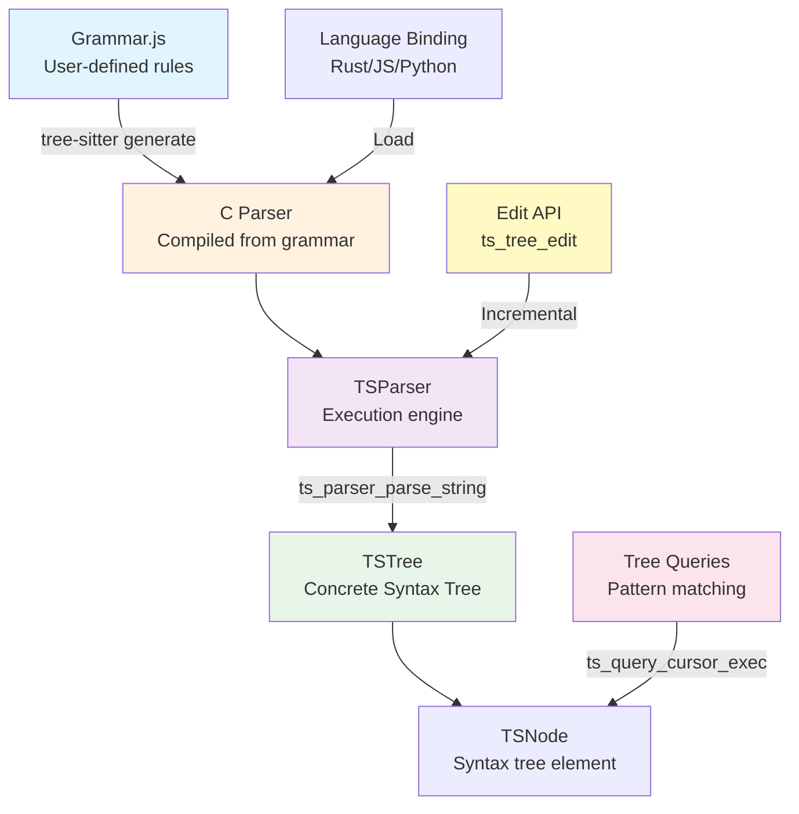
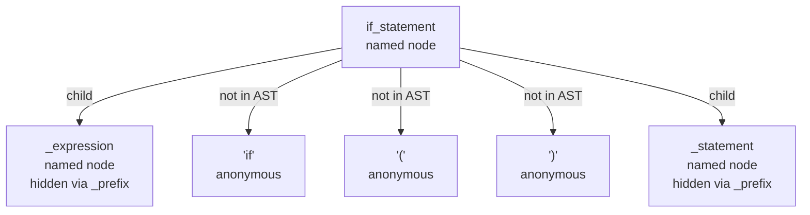

# `[tool]` `[tool-dive]` Tree-sitter Concepts

Source: tree-sitter

Link: https://tree-sitter.github.io

## Takeaways

- Design for IDEs: Tree-sitter prioritizes fast **incremental re-parsing** and **token position fidelity** over theoretical parser properties.
- **CST design** balances detail and complexity by preserving all tokens while using named nodes (grammar rules) vs. anonymous nodes (inline strings).
- **Incremental parsing** only re-parses edited ranges by reusing unchanged subtrees, critical for real-time editor feedback.
- **GLR** explores all parse branches at runtime and scores with dynamic precedence, handling true ambiguities without grammar restrictions.
- **Queries separate concerns**: Tree navigation is independent of grammar design, enabling services to evolve without grammar changes.

## Abstract

This section covers tree-sitter's architecture, design principles, and core concepts.

1. **Concepts** (this article): Design philosophy, architecture, IDE optimization.
2. **Grammar** ([Guideline](./grammar/grammar-guideline.md) & [Syntax](./grammar/grammar-syntax.md)): Author grammars with design principles and DSL reference.
3. **Query System** ([Queries](./tree-sitter-query.md)): Pattern matching for data extraction and tree navigation.
4. **Services** ([Services](./tree-sitter-services.md)): Syntax highlighting, code navigation, language injection.

## Introduction

Tree-sitter is:

- A parser generator tool, taking a grammar described in JS and yielding an incremental parsing library in C.
- Runtime in various languages to load the generated C library.

## The Context

Covered in [the Strange Loop talk](../tree-sitter-strange-loop.md).

Roughly:

- Before tree-sitter, most IDE (vscode, sublime) features (such as syntax-highlighting, code folding) were implemented in terms of regexes.
- This caused a lot of problems:
  - Inconsistent highlighting: The same type of tokens were not in the same color in some edge cases (weird formatting convention) or even in some pretty common case.
  - Regexes highlighting can easily break, such as when inspecting the bundled JS.
  - Slow (at least slower than tree-sitter).
- So, tree-sitter was created to addressed these issues, reporting:
  - Faster processing of source code.
  - Consistent highlighting.
  - Enable many DX features.
  - Unified interface for toolings.

## Design Philosophy

Some of the design philosophy of tree-sitter can be found in [the Strange Loop talk](../tree-sitter-strange-loop.md):

- Arbitrary analysis based on syntax tree.
- In-process incremental parsing.
- No dependencies.

On the tree-sitter homepage, tree-sitter aims to, quoted in verbatim, be:

- **General** enough to parse any programming language
- **Fast** enough to parse on every keystroke in a text editor
- **Robust** enough to provide useful results even in the presence of syntax errors
- **Dependency-free** so that the runtime library (which is written in pure C11) can be embedded in any application

Additional source: https://zed.dev/blog/syntax-aware-editing.

IDE-centric design:

- Tree-sitter was designed with IDE-centric workflow in mind.
- Concrete syntax trees retain all token locations to support many editor features.
- Flexible queries match structural patterns independently from grammar design.
- Grammar + query set = language support without custom traversal code.
  > This aligns with Loupe's goal: syntactic code analysis and querying tool.



## Practical Use Cases

Source: https://zed.dev/blog/syntax-aware-editing.

- These features in Zed are implemented using tree-sitter queries:
  - Syntax highlighting (example query from their blog):

    ```racket
    ["do" "for" "while"] @keyword

    (function
    name: (identifier) @function)

    (pair
    key: (property_identifier) @function.method
    value: [(function) (arrow_function)])
    ```

  - Symbol outlines (example query from their blog) - fuzzy search symbols within another symbol/context:

    ```racket
    (impl_item
      "impl" @context
      trait: (_)? @name
      "for"? @context
      type: (_) @name) @item

    (function_item
      (visibility_modifier)? @context
      (function_modifiers)? @context
      "fn" @context
      name: (_) @name) @item
    ```

  - Auto-indentation (example query from their blog):

    ```racket
    (statement_block "}" @end) @indent

    [
      (assignment_expression)
      (member_expression)
      (if_statement)
    ] @indent
    ```

  - Language injection (example query from their blog) - sometimes, inside a source code in a language comes another language (e.g. HTML & JS or Rust macro):

    ```racket
    (script_element
      (raw_text) @content
      (#set! "language" "javascript"))
    ```

    > Kind of look like Lexer mode in ANTLR.

## User-facing API

Tree-sitter's API follows a layered approach:

- Core APIs handle efficient parsing & a unified AST representation.
- High-level APIs provide convenience features.

Four main object types:

1. Languages (`TSLanguage` in the C API).
   - An (opaque) object representing the programming language parsing logic/rules (not the current parsing states).
   - The implementations for specific Language objects are generated by tree-sitter.
2. Parsers (`TSParser` in the C API).
   - The language parser itself, which can be assigned a language object.
   - Can accept some source code and produce a `TSTree`.
3. Syntax trees (`TSTree` in the C API).
   - The syntax tree of a piece of a source code.
   - Composed of `TSNode`s.
   - Can be editted to produce a new `TSTree`.
4. Syntax nodes (`TSNode` in the C API).
   - A single node in the syntax tree.
   - Tracks start and end positions & relation to other nodes.

Example flow using a generated parser in C:

1. Create a `TSParser` instance.
2. Set the `TSParser` with a `TSLanguage`.
3. Trigger the parser to produce a `TSTree`.
4. Query the `TSTree` and retrieve `TSNode`s.

Example program:

```c
#include <stdio.h>
#include <string.h>
#include <tree_sitter/api.h>

// **Language**
// Declare the external grammar function. This is generated by Tree-sitter
// and contains all the syntax rules for JSON.
const TSLanguage *tree_sitter_json(void);

int main() {
    // The source code we want to parse
    const char *source_code = "{\"name\": \"Gemini\"}";
    uint32_t source_len = strlen(source_code);

    // **Parser**
    // Create the parser and equip it with the JSON language grammar
    TSParser *parser = ts_parser_new(); // Dynamically allocated
    ts_parser_set_language(parser, tree_sitter_json());

    // **Parse tree**
    // Instruct the parser to read the string and build the entire tree.
    TSTree *tree = ts_parser_parse_string(
        parser,
        NULL,           // Previous tree (used for incremental parsing, NULL for first time)
        source_code,    // The actual code
        source_len      // Length of the code
    );

    // **Tree node**
    // Extract the absolute top node of the tree to begin our traversal.
    TSNode root_node = ts_tree_root_node(tree);


    // Cleanup memory
    ts_tree_delete(tree);
    ts_parser_delete(parser);

    return 0;
}
```

### Parser API

`TSParser` accepts input via: string buffer (`const * string` with `uint32_t length`) or custom `TSInput` interface.

- `ts_parser_parse_string`: Accept string buffer with incremental parsing support.
  ```c
  TSTree *ts_parser_parse_string (
    TSParser *self,
    const TSTree *old_tree, // possibly for incremental parsing like in the Strange Loop talk
    const char *string,
    uint32_t length
  )
  ```
- `ts_parser_parse`: Accept a custom data structure consumer:
  ```c
  TSTree *ts_parser_parse(
   TSParser *self,
   const TSTree *old_tree, // possibly for incremental parsing like in the Strange Loop talk
   TSInput input
  );
  ```

### Syntax Nodes (& Trees)

DOM-style interface for inspection:

Position APIs:

- `ts_node_type`: Node type identifier corresponding to grammar rule.
- `ts_node_start_byte`/`ts_node_end_byte`: Raw byte offsets.
- `ts_node_start_point`/`ts_node_end_point`: Zero-based row/column coordinates. Only `\n` is newline separator.

Tree navigation:

- `ts_tree_root_node`: Get root node from tree.
- `ts_node_child`: Access children via array index.
- `ts_node_next_sibling`/`ts_node_prev_sibling`: Navigate siblings (may return null node).
- `ts_node_parent`: Navigate to parent node.

#### Named and Anonymous Nodes

Problem: CSTs preserve all tokens, creating deeply nested trees tedious to traverse.

Solution: Distinguish two node types for selective AST inclusion:

- **Named nodes**: Explicit grammar rules (e.g., `if_statement`, `expression`). Always appear in parse tree.
- **Anonymous nodes**: Inline strings/regexes (e.g., `"if"`, `"("`, `";"`). Hidden from parse tree by default.

```js
if_statement: $ => seq("if", "(", $._expression, ")", $._statement);
^^^^^^^^^^^^           ^^^   ^^^                 ^^^
named node        anonymous nodes (hidden from AST)
```

This distinction enables unambiguous, detailed grammars while keeping trees manageable.



#### Node Field Names

Access child nodes:

- By index: Default approach via children array.
- By field name: More convenient when field names are known.

> Like ANTLR, supports both indexed and named accesses.

```c
TSNode ts_node_child_by_field_name(
  TSNode self,
  const char *field_name,    // Unique field name from grammar
  uint32_t field_name_length
);
```

Field name lookup optimization:

- String comparisons are repeated and inefficient.
- Tree-sitter interns field names into `TSFieldId` for efficient lookup.

```c
uint32_t ts_language_field_count(const TSLanguage *);
const char *ts_language_field_name_for_id(const TSLanguage *, TSFieldId);
TSFieldId ts_language_field_id_for_name(const TSLanguage *, const char *, uint32_t);
```

### Tree Edit

Problem: Source edits invalidate tree byte positions. Reparsing entire file is wasteful.

Solution: Two-step incremental update:

1. Edit tree structure: Tell tree-sitter what changed (old/new byte range, position delta).

   ```c
   typedef struct {
     uint32_t start_byte;       // Edit start
     uint32_t old_end_byte;     // Old end position
     uint32_t new_end_byte;     // New end position
     TSPoint start_point;       // Start as row/column
     TSPoint old_end_point;     // Old end as row/column
     TSPoint new_end_point;     // New end as row/column
   } TSInputEdit;

   void ts_tree_edit(TSTree *, const TSInputEdit *);
   ```

2. Reparse with old tree as context:

   ```c
   TSTree *new_tree = ts_parser_parse_string(
     parser,
     old_tree,           // Enable incremental parsing
     updated_source,
     new_length
   );
   ```

Rough flow:

1. Source change.
2. Invoke `ts_tree_edit` to update the tree's range
3. Invoke `ts_parser_parse` with the old tree.
4. New tree with reused structure.

Why do you need to call `ts_tree_edit` first? Wouldn't call re-parse with the old tree suffice? My guess is that it would be more efficient incrementally if tree-sitter knows the editted position from the get-go.

> Warning!
>
> Old extracted `TSNode` references become invalid after reparse.
> These will need to be updated via `ts_node_edit()` or fresh nodes can be refetched instead.

My theory is that `TSNode` does not contain source text information? So, the edit API does not convey information about the new source.

### Language Injection Support

Many documents contain multiple languages (e.g., HTML with embedded JS, Bash with heredocs).

Tree-sitter stitches disjointed segments as one unified syntax tree.

```racket
typedef struct {
  TSPoint start_point;
  TSPoint end_point;
  uint32_t start_byte;
  uint32_t end_byte;
} TSRange;

void ts_parser_set_included_ranges(
  TSParser *self,
  const TSRange *ranges,
  uint32_t range_count
);
```

Example: ERB document with embedded HTML and Ruby.

```html
<ul>
  <% people.each do |person| %>
  <li><%= person.name %></li>
  <% end %>
</ul>
```

Steps:

1. Parse entire document with root language (ERB).
2. Identify nodes with embedded languages in AST.
3. Extract boundaries into separate `TSRange` arrays.
4. Switch parser language via `ts_parser_set_language`.
5. Feed ranges to parser via `ts_parser_set_included_ranges`.
6. Re-parse to generate isolated syntax trees per language.

### Concurrency Support

`TSTree` instances are not thread-safe. However, they can be cheaply copied via `ts_tree_copy(TSTree *)`:

- `TSTree`s are immutable.
- An atomic counter is incremented to keep track of completely freed `TSTree`s.

### (Efficient) Tree Traversal

The problem with the standard node fetching APIs (index/named access):

- Stateless.
- Therefore, repeated accesses would need to recalculate positions from scratch.
- Suitable for occasional accesses.

For bulk traversal, use tree cursors.

- `ts_tree_cursor_new(TSNode)`: Create cursor from node.

- `ts_tree_cursor_goto_first_child`: Move to first child.
- `ts_tree_cursor_goto_next_sibling`: Move to next sibling.
- `ts_tree_cursor_goto_parent`: Move to parent.

- `ts_tree_cursor_current_node`: Get full node (triggers lazy evaluation).
- `ts_tree_cursor_current_field_name`: Get field name.
- `ts_tree_cursor_current_field_id`: Get field ID.

```c
// 1. Initialize the cursor (this node becomes the impenetrable boundary)
TSTreeCursor cursor = ts_tree_cursor_new(start_node);

// 2. Traversal Flow
// Try moving down into the children (O(1) operation)
if (ts_tree_cursor_goto_first_child(&cursor)) {

    // 3. Extract lightweight data directly
    const char *field = ts_tree_cursor_current_field_name(&cursor);

    // 4. Extract the full node struct only if actually needed
    TSNode current = ts_tree_cursor_current_node(&cursor);

    // 5. Move horizontally (O(1) operation)
    if (ts_tree_cursor_goto_next_sibling(&cursor)) {
        // Evaluates the next sibling
    }

    // 6. Move back up the tree
    ts_tree_cursor_goto_parent(&cursor);
}
```

## Resources for the Design & Implementation

- General design: [tree-sitter doc](https://tree-sitter.github.io/tree-sitter/using-parsers/1-getting-started.html)

- Parsing functionality:
  - [tree_sitter/api.h header file](https://github.com/tree-sitter/tree-sitter/blob/master/lib/include/tree_sitter/api.h)
  - [Other language bindings similar to tree_sitter/api.h, especially the official ones](https://tree-sitter.github.io/tree-sitter/index.html#language-bindings).
